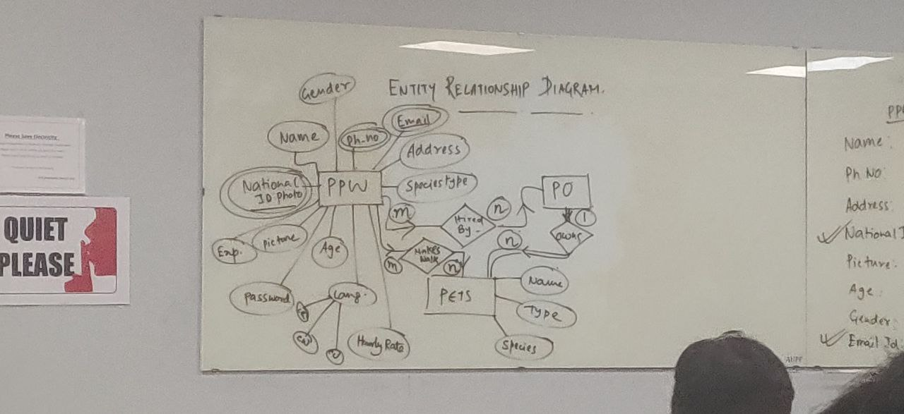
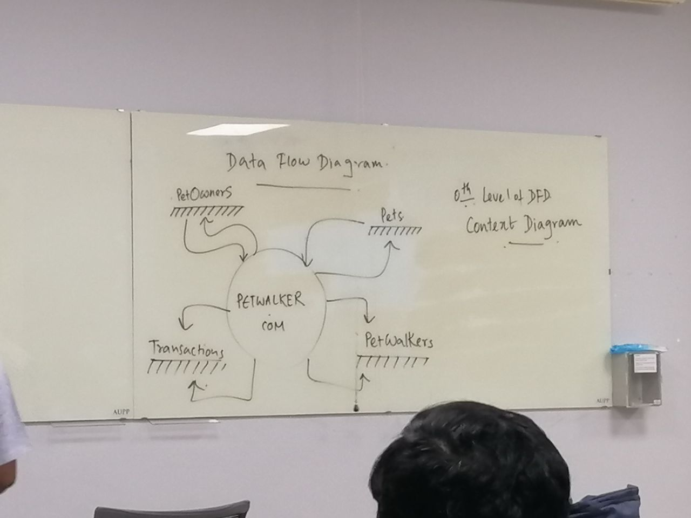
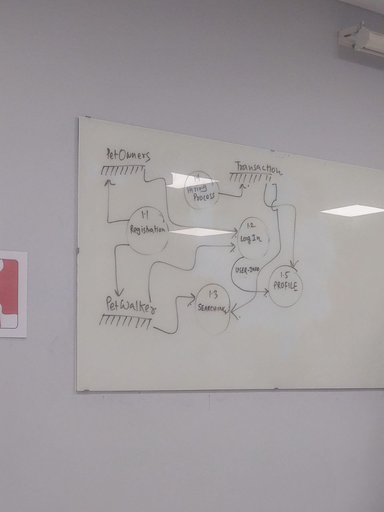

# Database And SQL
No note here.
## ENTITY RELATIONSHIP DIAGRAM

## DATA FLOW DIAGRAM
- 0th Level Of DFD - Content Diagram

- Next level

## Types of database
1. Relational database
2. OOD - Object Oriented Database
3. Hierarchical Database
4. No SQL

>**Note:**
The current web page context is empty, so I searched the web for your question. Here is what I found:
>
>There are many different types of databases, depending on the data model, location, design, hosting, and processing power they use. Some of the common types of databases are:
>
>- **Relational databases**: These databases store data in tables, which consist of rows and columns. Each row represents a record and each column represents an attribute. Relational databases use Structured Query Language (SQL) to manipulate data and enforce integrity constraints. Examples of relational databases are MySQL, Oracle, and PostgreSQL¹².
>- **Non-relational databases (NoSQL)**: These databases store data in a variety of formats that are not based on tables. They are more flexible and scalable than relational databases and can handle large volumes of unstructured or semi-structured data. Some of the common types of NoSQL databases are document databases, key-value stores, column-oriented databases, and graph databases. Examples of NoSQL databases are MongoDB, Redis, Cassandra, and Neo4j¹².
>- **Object-oriented databases**: These databases store data as objects, which have attributes and methods that define their behavior. Object-oriented databases support inheritance, polymorphism, and encapsulation, which are the core features of object-oriented programming languages. They also allow complex data types and relationships to be modeled more naturally than relational databases. Examples of object-oriented databases are db4o, ObjectDB, and Versant¹³.
# DAY 2
Go to [OneCompiler SQL](https://onecompiler.com/mysql)

## SQL QUERIES
SQL - Structured Query Language

There are 2 types of statement in SQL:
1. DDL - Data Definition Language
2. DML - Data Manipulation Language

### DDL - DATA DEFINITION LANGUAGE Statement
- For define, change, or drop data. 
- Common DDL:
    - CREATE
    - ALTER
    - TRUNCATE
    - DROP

### DML - DATA MANIPULATION LANGUAGE Statement
- For 
    - Read and modify data
    - CRUD operations (Create, Read, Update, Delete)
- Common DML
    - INSERT
    - SELECT
    - UPDATE
    - DELETE

### QUERIES
See [3z8rgggqc](https://onecompiler.com/mysql/3z8rgggqc).
See [3z8rjr2vt](https://onecompiler.com/mysql/3z8rjr2vt)
